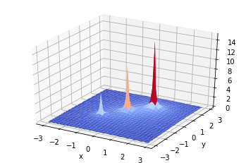

# Universality theorem

Jupyter notebook that demonstrates how neural network with one hidden layer can approximate an arbitrary real-valued function.
We restict ourselves to the 2D case, however the idea may be generalized.

The code is based on Michael Nielsen's [Neural Networks and Deep Learning book (Chapter 4)](http://neuralnetworksanddeeplearning.com/chap4.html).

  

